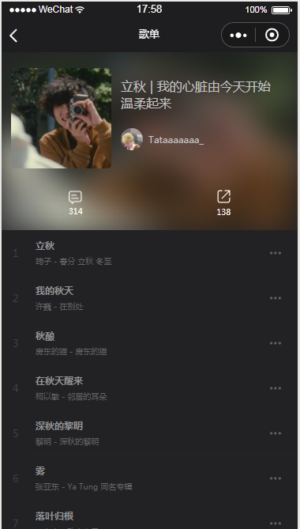
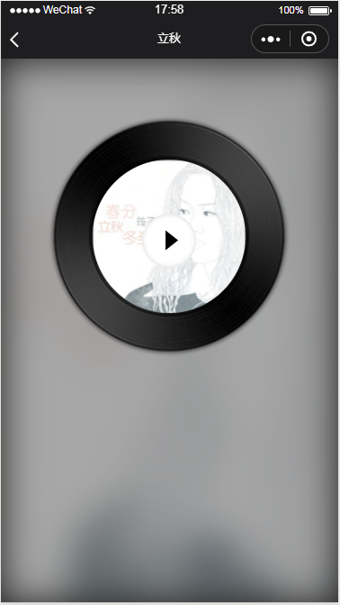
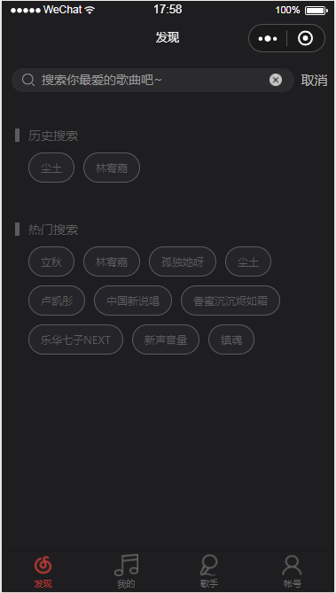
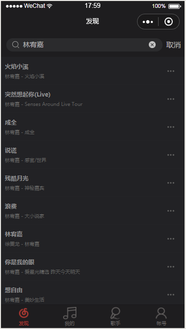

## 小程序高仿网易云音乐
## 说明
> 此项目为了练手小程序而写的，接口是github一个开源项目提供的，接口很齐全，开发了大部分的页面，还有一些细节可以优化，未来会慢慢更新。

## 项目运行
>先把接口clone下来，node启动就好

```
$ git clone https://github.com/Binaryify/NeteaseCloudMusicApi.git
$ node app.js
```

>然后再把小程序clone下来在微信开发者工具里面运行

```
$ git clone https://github.com/timofun/neteaseMusic-wxapp.git
```


## 项目截图 （只展示部分）




